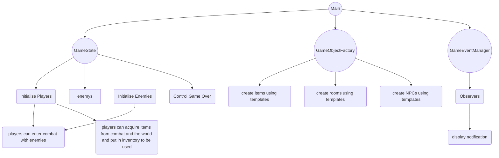
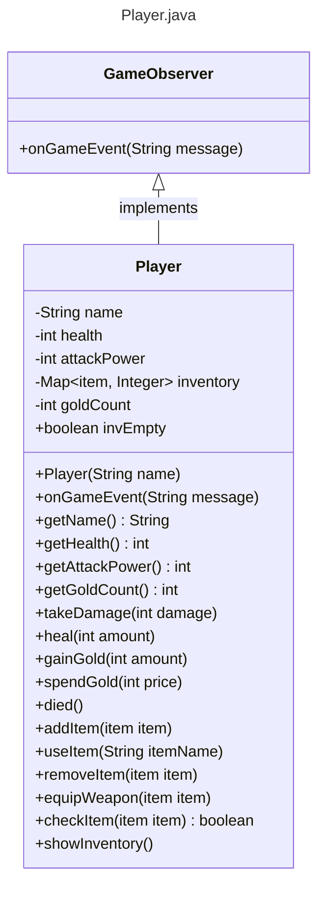

# CS1OP-CW1
## Front Page
- Module Code: CS1OP
- Assignment report Title: Project
- Student Number: 33016377
- Actual hrs spent for the assignment: approx 35 hrs
- Which Artificial Intelligence tools used (if applicable): OpenAI's ChatGPT

# Implementation Highlights
## Introduction
Going into my programming project, I had a vision of what kind of game I wanted to make. For me, I knew that it had to include some form of exploration to not only increase playtime but to also make the world seem more involved. This involves having the player backtrack to previous portions of the world to open a previously inaccessible area. The world is built up of a series of interconnected rooms which include a variety of things such as enemies, items, NPCs or puzzles. Additionally, players are able to add said items to their inventories and earn gold to spend in a shop from defeating enemies or looting areas. Messages are then displayed when players pick up important items or progress to an important area. I implemented a full combat system with a special attack for the boss at the end, as well as a guarding feature so players can reduce incoming damage. To make the game feel alive, I added the NPCs which the player can interact with which further improves the feeling of the game, with multiple input options which help flesh out the environment and could also provide missible secrets if the player chooses to ignore the options. Overall, the most important aspects to me are the ones that make the project feel alive and like a genuine game that not only works fluidly but is also an enjoyable experience.

## Requirements
The requirements for my extended implementation, prioritized top is most important, are as follows:
- worldtest.java
- GameObjectFactory.java
- GameState.java
- GameEventManager.java
- GameObserver.java
- Player.java
- templates.java
- room.java
- item.java
- Enemy.java
- Combat.java
- NPC.java
- GameObjectFactoryTest.java
- GameStateTest.java
- GameObserverTest.java

## Design

### System Architecture Diagram

### Simple Class Diagram Example

## Assumptions
My main major assumptions was assuming that, in theory, my testing works as I couldn't get JUnit to work but Visual Studio Code highlighted my testing as working with the green tick next to the test. I also assumed it was okay to include a riddle from 'The Hobbit' by JRR Tolkein which I have referenced below and will also reference in Coursework 2 in the references section.

## References
Tolkein, JRR. (1937) _The Hobbit._ London: George Allen & Unwin, Ltd